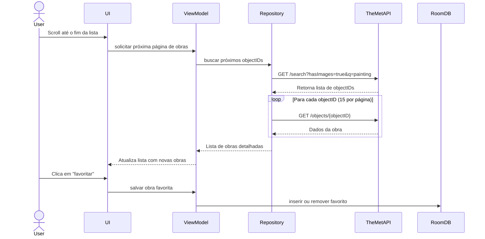

# Art Explorer - Desafio de Integração com a API do The Met Museum

## 🌟 Objetivo

Desenvolver um aplicativo Android em Kotlin para explorar obras de arte do acervo do Metropolitan Museum of Art (The Met), integrando-se com sua API aberta para listar obras com imagens, visualizar detalhes e permitir que o usuário marque obras como favoritas.

---

## 🔍 Funcionalidades Principais

1. **Listar Obras de Arte com Imagem**

   * Exibir 15 obras por vez com imagens.
   * Paginação simulada ao rolar até o final da lista.

2. **Favoritar Obras**

   * Marcar e desmarcar obras como favoritas.
   * Exibir favoritos em uma seção separada.
   * Persistência local usando Room.

3. **Detalhes da Obra**

   * Exibir dados como: título, artista, data, técnica, departamento e imagem.

4. **Interface Amigável**

   * Design responsivo.
   * Rolagem fluida e interativa.

5. **Testes Incluídos**

   * Testes unitários da lógica.
   * Testes de interface (UI Tests).

---

## 📄 Requisitos do Projeto

### 1. Integração com API

* Buscar obras usando `GET /public/collection/v1/search?hasImages=true&q=painting`
* Buscar detalhes usando `GET /public/collection/v1/objects/{objectID}`
* Usar paginação simulada (slice do array de IDs)

### 2. Paginação

* Carregar dinamicamente 15 objetos por vez
* Buscar dados a partir dos objectIDs retornados na pesquisa

### 3. Favoritos

* Marcar/desmarcar obras como favoritas
* Listar favoritos em aba/seção separada
* Persistência com banco local (Room/SQLite)

### 4. UI/UX

* Scroll infinito
* Layout moderno e responsivo
* Feedbacks visuais para falhas e carregamentos

### 5. Testes

* Testes unitários: Repositório, ViewModel
* Testes UI: interação com favoritos e carregamento da lista

### 6. Documentação

* README.md explicando:

  * Como executar o app
  * Endpoints utilizados
  * Detalhes da API e comportamentos esperados

---

## 🔗 Endpoints Utilizados da API The Met

| Funcionalidade             | Endpoint                                                           |
| -------------------------- | ------------------------------------------------------------------ |
| Listar IDs de obras        | `GET /public/collection/v1/search?hasImages=true&q=painting`       |
| Buscar detalhes da obra    | `GET /public/collection/v1/objects/{objectID}`                     |
| Listar departamentos       | `GET /public/collection/v1/departments`                            |
| Buscar por departamento    | `GET /public/collection/v1/search?departmentId=11&q=portrait`      |
| Buscar por artista/cultura | `GET /public/collection/v1/search?artistOrCulture=true&q=van+gogh` |

---

## ⌚ Diagrama de Sequência (Mermaid)



---

## 📊 Requisitos Desejáveis

* Logging com Timber ou Logcat
* Filtros avançados (departamento, artista, cultura, data)
* Loading indicators para chamada de rede
* Mensagens amigáveis de erro

---

## 📆 Entrega

1. **Fork do Repositório**

   * Realize um fork deste repositório no GitHub.

2. **Criar uma Branch com seu Nome**

   * O nome deve ser em letras minúsculas e separado por underscores `_`.
   * Exemplo:

     ```bash
     git checkout -b joao_silva_souza
     ```

3. **Subir o Projeto**

   ```bash
   git add .
   git commit -m "Entrega do desafio - João Silva Souza"
   git push origin joao_silva_souza
   ```

4. **Abrir um Pull Request (PR)**

   * No repositório original, abra um PR com:

     * **Branch**: sua branch criada
     * **PR Title**: `Entrega - joao_silva_souza`
     * **PR Body**: Nome completo, data da entrega, observações adicionais (opcional)

---

## 🎓 Licença

Os dados são fornecidos pela **The Met Museum Open Access API** sob licença [CC0 1.0 Universal](https://creativecommons.org/publicdomain/zero/1.0/).

---

## 📢 Contato

* Autor: Leandro Costa
* Email: [leandro@jaya.tech](mailto:leandro@jaya.tech)
